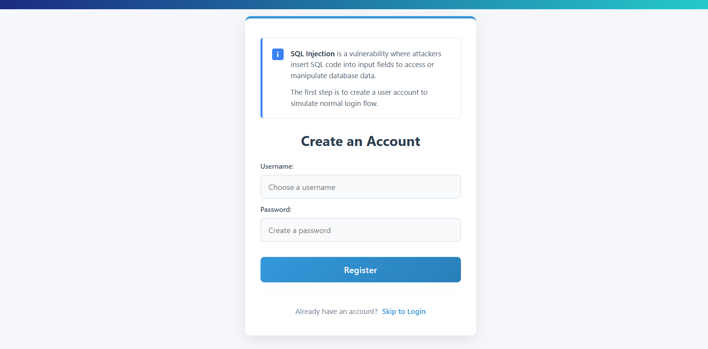
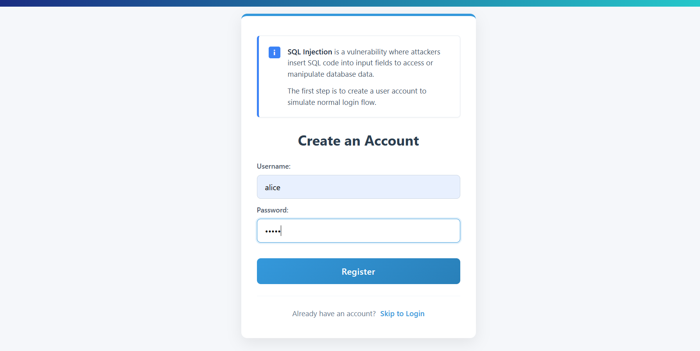
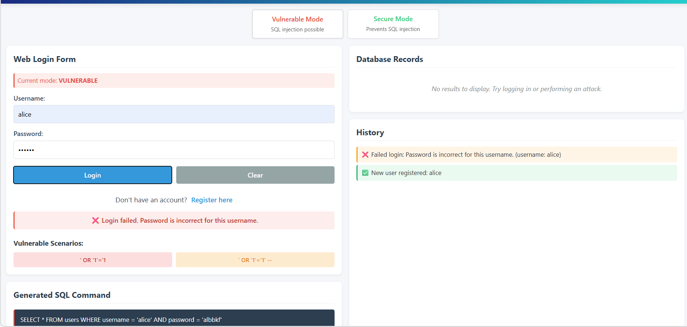
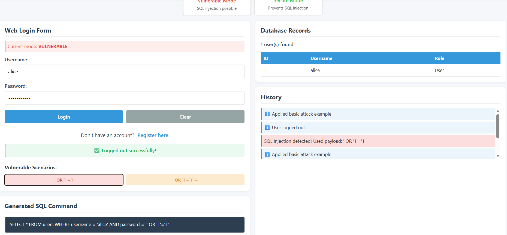
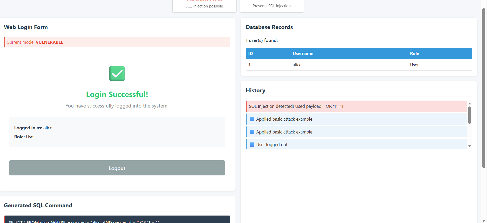
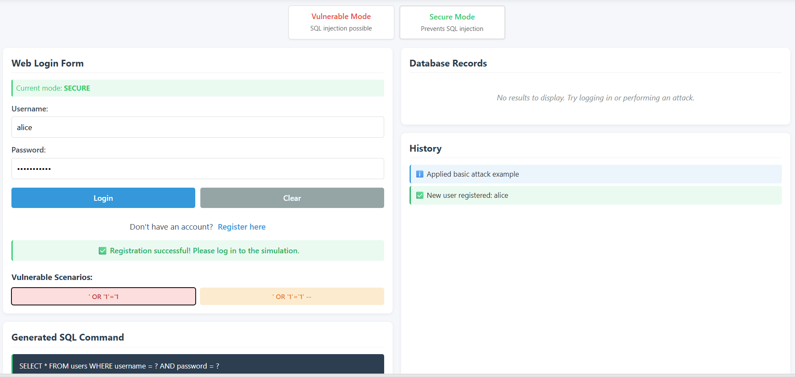
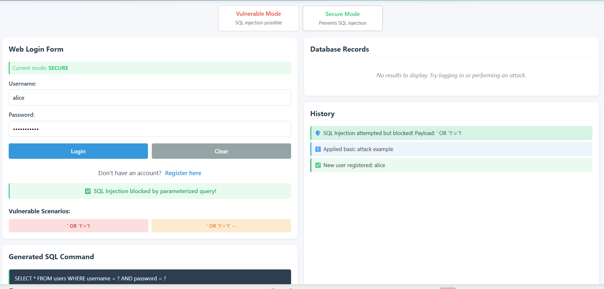

#### Step 1: Create an Account
The first step in the simulation is to create a valid user account to establish a baseline for normal login behavior.
1. Click on the **Create an Account** screen if not already there.
2. Enter a **Username** (e.g., `alice`) and a **Password**.
3. Click **Register**.

#### Step 2: Normal Login (Vulnerable Mode)
After creating an account, verify that the login works correctly under normal conditions.
1. Navigate to the **Web Login Form**.
2. Ensure the **Current mode** is set to **VULNERABLE**.
3. Enter the correct credentials for the account created in Step 1.
4. Observe the **Generated SQL Command** and the **History** panel showing a successful login.

#### Step 3: Perform SQL Injection Attack (Tautology-Based)
Now, attempt to bypass authentication using a SQL Injection payload.
1. Enter any username (e.g., `alice`).
2. In the password field, enter the payload: `' OR '1'='1`.
3. Click **Login**.
4. Observe how the **Generated SQL Command** is altered by the payload, causing the database to return the user record without requiring a valid password.
5. The **Login Successful!** message will appear even though the password was incorrect.

#### Step 4: Switch to Secure Mode
Implement countermeasures by switching the application to use parameterized queries.
1. Click on the **Secure Mode** button at the top of the interface.
2. Observe that the **Current mode** changes to **SECURE**.
3. Note the change in the **Generated SQL Command** template, which now uses placeholders (`?`) instead of direct string concatenation.

#### Step 5: Verify SQL Injection Mitigation
Test the same SQL Injection payload in Secure Mode to verify that it is no longer effective.
1. Re-enter the same payload: `' OR '1'='1` in the password field.
2. Click **Login**.
3. Observe the **History** and the **Login Form**. The application now treats the payload as literal data.
4. A **SQL Injection blocked!** or login failure message will be displayed, confirming that the vulnerability has been patched.

